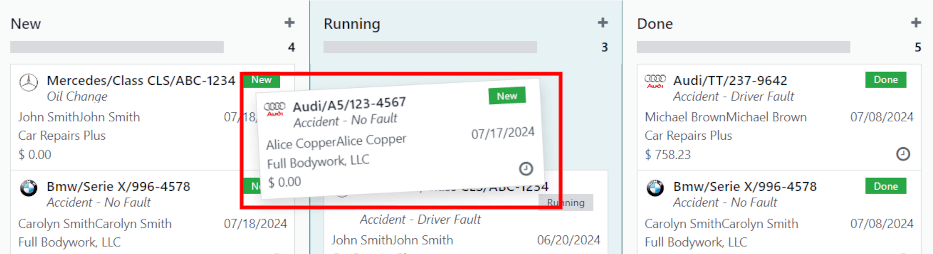

=========
Accidents
=========

When managing a fleet of vehicles, eventually, accidents will occur. It is important to track these
occurrences to gain insights, from seeing how much vehicles cost to keep on the road, to identifying
the safest drivers.

Due to the customizable nature of Odoo's *Fleet* app, there are several different ways to track
accidents. The instructions below provide step by step instructions for only **one** method to keep
track of accidents and their subsequent repair costs.

Structure
=========

For this example, to track accidents, two :ref:`service types <fleet/new-type>` are created:
`Accident - Driver's Fault` and `Accident - No Fault`.

This will make it possible to track the various repairs associated with accidents, organized by the
type of accident (who was at fault).

When an accident occurs, a service record is created. The specific repairs needed for the accident
are logged in the *description* of the service record, and the details about the accident (what
happened) are logged in the *notes* section.

With this organizational structure, it is possible to view all accidents organized by fault, car,
driver, or cost.

.. seealso::
   To manage accidents, the creation of service records is **required**.

   Refer to the :doc:`service` documentation for detailed instructions on creating service records
   in Odoo's *Fleet* app.

Log accidents and repairs
=========================

After an accident occurs, repairs are usually needed. To log an accident, the first step is to
:ref:`create a service record <fleet/service-form>` detailing the specific repairs needed.

.. note::
   Some accidents require multiple repairs with several different vendors. For these scenarios, a
   separate service record is needed for each vendor performing repairs. To keep records organized,
   it is recommended to keep the :guilabel:`NOTES` field identical, as well as attaching the same
   important documentation, such as a police report.

Navigate to :menuselection:`Fleet app --> Fleet --> Services` to view the main :guilabel:`Services`
dashboard. Click :guilabel:`New` in the top-left corner and a blank service form loads.

Enter the following information on the form:

- :guilabel:`Description`: enter the description of repairs needed to fully repair the vehicle, such
  as `Bodywork`, `Windshield Replacement`, or `Replacement Bumper, Tires, and Windows`.
- :guilabel:`Service Type`: select either `Accident - Driver's Fault` or `Accident - No Fault`,
  depending on the situation.

  When entering either of these two :guilabel:`Service Types` for the first time, enter the new
  service type, then click :guilabel:`Create (new service type)`.

  Once an accident service type has been added to the database, it is available to select from the
  drop-down menu in the :guilabel:`Service Type` field.
- :guilabel:`Date`: using the calendar popover window, select the date the accident occurred.
  Navigate to the desired month using the :icon:`fa-chevron-left` :icon:`fa-chevron-right`
  :guilabel:`(chevron)` icons, then click on the date to select it.
- :guilabel:`Cost`: leave this field blank, as the repair cost is not yet known.
- :guilabel:`Vendor`: select the vendor performing the repairs using the drop-down menu. If the
  vendor has not already been entered in the system, type in the vendor name, and click either
  :guilabel:`Create` to add them, or :guilabel:`Create and edit...` to :ref:`add and configure the
  vendor <fleet/new-vendor>`.
- :guilabel:`Vehicle`: select the vehicle that was in the accident from the drop-down menu. When the
  vehicle is selected, the :guilabel:`Driver` field is populated, and the unit of measure for the
  :guilabel:`Odometer Value` field appears.
- :guilabel:`Driver`: the current driver listed for the selected vehicle populates this field when
  the :guilabel:`Vehicle` is selected. If a different driver was operating the vehicle when the
  accident occurred, select the correct driver from the drop-down menu.
- :guilabel:`Odometer Value`: enter the odometer reading when the accident occurred. The units of
  measure are either in kilometers (:guilabel:`km`) or miles (:guilabel:`mi`), depending on how the
  selected vehicle was configured.
- :guilabel:`NOTES`: enter the specific details for the accident at the bottom of the service form,
  such as `Hit a deer` or `Rear ended at an intersection while stopped`.
- :guilabel:`Files`: attach any important paperwork, such as police reports, to the service record.
  Click the :icon:`fa-paperclip` :guilabel:`(paperclip)` icon, located either to the far-right of
  the screen, or below the service record (depending on the size of the browser window), and a file
  explorer window pop-up window appears. Navigate to the desired record, and click :guilabel:`Open`
  to upload the file.

  .. note::
     Once a file is added to a service record, clicking the :icon:`fa-paperclip`
     :guilabel:`(paperclip)` icon makes the :guilabel:`Files` section appear. To attach more
     records, click :icon:`fa-plus-square` :guilabel:`Attach files` to add more documents.

.. image:: accidents/service-form.png
   :align: center
   :alt: Enter the information for an accident repair.

Service stages
==============

In Odoo's *Fleet* app, there are four default service stages:

.. tabs::

   .. tab:: New

      The default stage when a service record is created. The service has been requested, but
      repairs have not begun. The cost field for this stage remains zero.

   .. tab:: Running

      The repair is in-process but not yet complete. The estimate for repairs is listed in the cost
      field.

   .. tab:: Completed

      All repairs listed on the service form have been completed. The cost field is updated to
      reflect the final total cost charged for the repairs.

   .. tab:: Cancelled

      The service request has been canceled. Some common scenarios for this is when the estimate is
      higher than the remaining vehicle value, and is deemed not worth repairing.

During the repair process, change the service status to reflect the vehicle's current status in one
of two ways: on the individual :ref:`service record <fleet/service_record>`, or in the :ref:`Kanban
service view <fleet/Kanban>`.

.. _fleet/service_record:

Service record
--------------

Open the main :guilabel:`Services` dashboard by navigating to :menuselection:`Fleet app --> Fleet
--> Services`. Next, click on the individual service record to open the detailed service form. Click
the desired stage in the top-right corner above the service form to change the status.

.. _fleet/Kanban:

Kanban view
-----------

Open the main :guilabel:`Services` dashboard by navigating to :menuselection:`Fleet app --> Fleet
--> Services`. First, remove the default :guilabel:`Service Type` filter in the
:guilabel:`Search...` bar, then click the :icon:`oi-view-kanban` :guilabel:`Kanban` icon in the
top-right of the screen.

All services appear in a Kanban view, organized by their respective :guilabel:`Status`.
Drag-and-drop the service record to the desired stage.

Accident reporting
==================

One of the main reasons to track accidents using the method outlined in this document is the ability
to view the total accident cost, determine the safest drivers, and determine the actual total cost
for specific vehicles.

The main :ref:`Services dashboard <fleet/services_dashboard>` displays all the various accident
information, while the :ref:`Reporting dashboard <fleet/reporting_dashboard>` displays the total
cost for specific vehicles.

.. _fleet/services_dashboard:

Services dashboard
------------------

Navigate to :menuselection:`Fleet app --> Fleet --> Services` to view the default
:guilabel:`Services` dashboard. All service records are displayed in a :icon:`oi-view-list`
:guilabel:`(List)` view, grouped alphabetically, by :guilabel:`Service Type`.

The two service types created for accident tracking appear in the list: :guilabel:`Accident -
Driver Fault` and :guilabel:`Accident - No Fault`.

Each grouping displays the number of records within each grouping, and lists the individual records
beneath each grouping title.

.. example::
   In this example, there are six accidents where the driver was at fault, and four accidents that
   were not the driver's fault. This default dashboard also displays the estimated total
   :guilabel:`Cost` for all the accidents in each group.

   There is an estimated `$19,164.81` dollars for driver-caused accident repairs, and an estimated
   `$2,548.21` dollars for no-fault accidents.

   .. image:: accidents/group-accidents.png
      :align: center
      :alt: Accident services, with the total costs highlighted.

.. note::
   The total :guilabel:`Cost` calculates **all** costs on the repair form, including estimated costs
   as well as final repair costs. This number may not be accurate if there are any repairs in the
   :guilabel:`Running` stage, and the final bill has not yet been calculated.

.. _fleet/reporting_dashboard:

Reporting dashboard
-------------------

Navigate to :menuselection:`Fleet app --> Reporting --> Costs` to view the default
:menuselection:`Cost Analysis` report. The default report displays a  :icon:`fa-bar-chart`
:guilabel:`(Bar Chart)` of all :guilabel:`Contract` and :guilabel:`Service` costs for the current
year, organized by month (:guilabel:`Date`).

To view the total cost by vehicle, click the :icon:`fa-caret-down` :guilabel:`(down caret)` icon at
the far-right of the :guilabel:`Search...` bar, revealing a drop-down menu. Click
:guilabel:`Vehicle` in the :icon:`oi-group` :guilabel:`Group By` column, and the data is organized
by vehicle.

This displays the true cost for each vehicle, including both the contract cost (such as the monthly
vehicle lease cost) and all service costs, including all accidents. This allows for a more complete
view of the vehicle cost.

.. image:: accidents/total-costs.png
   :align: center
   :alt: The Cost Analysis report, displaying total costs by vehicle.

Managing accident repairs
=========================

For companies with multiple employees managing a large fleet of vehicles, displaying only services
in the :guilabel:`New` and :guilabel:`Running` stages can be time-saving.

Navigate to the main :guilabel:`Services` dashboard, where all service requests are organized by
:guilabel:`Service Type`. Next, click the :icon:`fa-caret-down` :guilabel:`(down caret)` icon at the
far-right of the :guilabel:`Search...` bar, revealing a drop-down menu. Click :guilabel:`Add Custom
Filter` in the :icon:`fa-filter` :guilabel:`Filters` column., and a :guilabel:`Add Custom Filter`
pop-up window appears.

There are three drop-down fields to populate on the pop-up window. In the first field, scroll down
and select :guilabel:`Stage`. Leave the second field as-is, with the :guilabel:`= (equal)` sign.
Select :guilabel:`Running` from the drop-down menu in the last field. Next, click the
:icon:`fa-plus` :guilabel:`(plus)` icon to the right of the last field, and an identical rule
appears beneath the current rule. Select :guilabel:`Running` from the drop-down menu in the last
field, leaving the other fields as-is. Click the :guilabel:`Add` button at the bottom to add the
new custom filter.

.. image:: accidents/custom-filters.png
   :align: center
   :alt: The filter settings to be added to only display new and running services.

This slight modification only presets services in the :guilabel:`New` and :guilabel:`Running`
stages. For a company managing a high number of repairs at any given time, displaying only services
that need to be managed or followed-up on, this is a helpful report.

To have this report appear as the default report when opening the :guilabel:`Services` dashboard,
click the :icon:`fa-caret-down` :guilabel:`(down caret)` icon at the far-right of the
:guilabel:`Search...` bar. Next, click :guilabel:`Save current search`, beneath the :icon:`fa-star`
:guilabel:`Favorites` column, which reveals another drop-down column beneath it. Click
:guilabel:`Default Filter` to have this customized :guilabel:`Services` dashboard appear by default,
anytime the :guilabel:`Services` dashboard is accessed.

