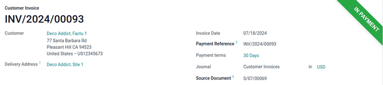

=============
Wire transfer
=============

The wire transfer payment method allows for payment instructions to be shared with a customer after
purchasing a product. With a subscription, these payment instructions are shared every time the
payment is renewed.

.. note::
   The wire transfer payment method requires minimal setup, but is inefficient compared to other
   online payment providers in most cases. It is recommended to use another payment provider with
   subscriptions due to wire transfers requiring manual confirmation for each payment.

.. _wire_transfer/configuration:

Configure wire transfers
========================

To use this payment method, first ensure the wire transfer payment method is *enabled*. Begin by
navigating to the *Payment Providers* page from the *Accounting*, *Website*, or *Sales* apps. For
example, navigate to :menuselection:`Accounting app --> Configuration --> Payment Providers`, then
click on the :guilabel:`Wire Transfer` card.

.. tip::
   If the Accounting app is not installed, the :guilabel:`Payment Providers` page can also be
   reached by navigating to :menuselection:`Website --> Configuration --> Payment Providers` or
   :menuselection:`Sales app --> Configuration --> Payment Providers`.

Next, set the :guilabel:`State` to :guilabel:`Enabled` to enable wire transfers. Use the drop-down
menus next to :guilabel:`Company` and :guilabel:`Website` to set where wire transfers can be used.

The options in the :guilabel:`Configuration` tab can be used to customize the wire transfer. Check
the box next to :guilabel:`Enable QR Codes` to enable the use of QR codes when paying by wire
transfer.

Use the drop-down menu next to :guilabel:`Communication` to select the communication type used on
sales orders. Choose :guilabel:`Based on Document Reference` to use the sales order or invoice
number, or :guilabel:`Based on Customer ID` to use the customer identifier. With either method
selected, communication is given to the customer once they choose the wire transfer payment method.

The configuration options listed under the :guilabel:`Availability` heading are used to set payment
restrictions. Use :guilabel:`Maximum Amount` to set a maximum payment value, :guilabel:`Currencies`
to restrict any currencies from being used for payment, and :guilabel:`Countries` to restrict
payment from any particular countries.

In the :guilabel:`Messages` tab, use the :guilabel:`Pending Message` box to add a message containing
wire transfer information. This message is displayed to the customer after confirming their order,
as well as if the order is marked as pending after the payment is processed.

If :doc:`a bank account <../../../finance/accounting/bank>` has already been defined, the account
number will be automatically added to the default message generated by Odoo. A bank account can also
be added afterwards, and the message updated with the appropriate bank information by clicking
:guilabel:`Reload pending message`.

Once all configuration settings are set, the :icon:`fa-eye-slash` :guilabel:`Unpublished`
smart button located at the top of the page automatically changes to :icon:`fa-globe`
:guilabel:`Published` to show that the wire transfer payment option is now visible to customers.

.. tip::
   Only keep the payment method published if payments are ready to be received. It is possible to
   keep the payment method enabled, but **not** visible to customers, until payments are ready to be
   received by setting the smart button to :icon:`fa-eye-slash` :guilabel:`Unpublished` after
   setting the :guilabel:`State` to :guilabel:`Enabled`.

.. image:: wire_transfer/wire-transfer-published.png
   :align: center
   :alt: The wire transfer card enabled and published.

Test mode
---------

The wire transfer payment method can be tested before it is accessed by customers by using *Test
Mode*. To enable Test Mode, set the :guilabel:`State` in the payment provider form to
:guilabel:`Test Mode` and an orange :guilabel:`Test mode` banner appears in the upper-right side of
the form.

Next, enter the credentials for a bank account with accessible transactions in the
:guilabel:`Messages` tab. To re-enable normal function after testing, change :guilabel:`State` to
:guilabel:`Enabled`.

.. note::
   By default, the payment provider remains **unpublished** in test mode so that it is not visible
   to visitors.

.. warning::
   It is recommended to use test mode on a duplicate or a test database to avoid potential issues
   with invoice numbering.

.. _wire_transfer/payment:

Pay by wire transfer
====================

With wire transfers :ref:`enabled and published <wire_transfer/configuration>`, customers will see
wire transfers as an available payment method at checkout when purchasing a product. When this
method is selected by a customer, they are shown the *Pending Message* set in the :ref:`wire
transfer configuration page <wire_transfer/configuration>` after confirming their purchase. Once
the purchase is confirmed, a sales order is created.

.. image:: wire_transfer/payment-instructions-checkout.png
   :align: center
   :alt: The wire transfer pending message shown to customers.

.. important::
   Online orders remain in the *Quotation sent* (i.e. unpaid order) stage until both the payment is
   received, *and* the order confirmed manually using the :guilabel:`Confirm` button on the sales
   order.

To begin processing the payment, navigate to :menuselection:`Sales app --> Orders --> Orders` and
click the corresponding sales order. A green :guilabel:`In Progress` banner appears in the
upper-right to show that payment has not been confirmed yet. Ensure the sales order is correct, then
click :guilabel:`Confirm` to confirm the sales order.

Next, click the new :guilabel:`Create Invoice` button, then choose :guilabel:`Regular invoice` and
click :guilabel:`Create Draft Invoice`. A draft of the invoice appears. Click :guilabel:`Confirm` to
validate the invoice.

To send this invoice to the customer, click the :guilabel:`Send & Print` button. A :guilabel:`Send`
pop-up window is revealed with an email template configured and a PDF invoice attached.

Ensure the information is correct, then click :guilabel:`Send & Print`. The pop-up window
disappears and the :guilabel:`Send & Print` button turns gray to show the invoice has been sent.

.. tip::
   The default template for sending an invoice can be modified by navigating to
   :menuselection:`Settings app --> Companies --> Email Templates --> Review All Templates -->
   Invoice: Sending`.

Now click the :guilabel:`Register payment` button on the invoice page. A pop-up window titled
:guilabel:`Register Payment` is revealed with options for selecting the type of payment. In the
field to the right of :guilabel:`Journal`, type `Bank` or select it from the drop-down menu. Next,
set :guilabel:`Payment Method` to `Manual`. Ensure :guilabel:`Amount` and :guilabel:`Payment Date`
are correct, then click the :guilabel:`Create Payment` button.

.. image:: wire_transfer/register-payment.png
   :align: center
   :alt: The register payment pop-up window.

The customer invoice is revealed with a green :guilabel:`In payment` banner in the upper-right
corner. At this point, the flow is now complete.

.. note::
   If payment has been received before sending the invoice, such as in cash, the payment can still
   be registered in Odoo by clicking the :guilabel:`Register Payment` button and creating the
   payment *before* clicking :guilabel:`Send & Print`. Now when an invoice is sent using the
   :guilabel:`Send & Print` button, a new line is automatically added to the invoice message
   stating that the invoice is already paid.
