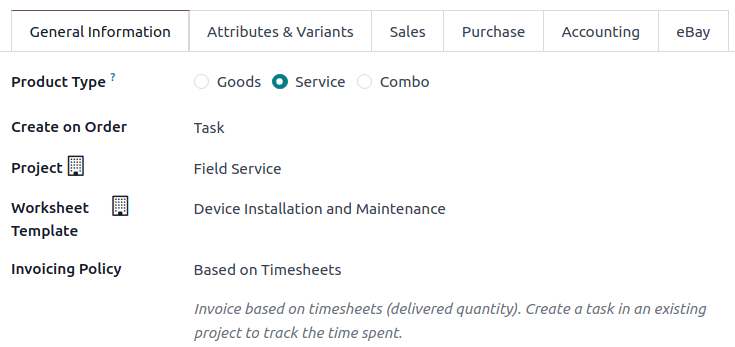

============================
Creating Field Service Tasks
============================

Creating tasks in **Field Service** from a sales order or a helpdesk ticket is faster and easier
since these already contain a lot of information that will be imported automatically into your field
service task, but it is also possible to create one manually from scratch.

Manually
========

 #. Go to :guilabel:`Field Service`
 #. Click on :guilabel:`New`
 #. Fill in the :guilabel:`Task Title` and :guilabel:`Customer` (all other fields are optional),
    then click :guilabel:`Save`

Task configuration
------------------

Click the task to open it. The task form includes the following fields that you can fill in:

 - :guilabel:`Task Title`: title of the task.
 - :icon:`fa-star-o` (:guilabel:`Star`): click the :icon:`fa-star-o` (:guilabel:`star`) icon to mark
   the task as high priority. The icon will turn yellow. Click it again to remove the high priority.
 - :guilabel:`Project`: the project that this task belongs to.
 - :guilabel:`Worksheet Template`: the worksheet template you want to use for this task.
 - :guilabel:`Assignees`: the person(s) in charge of handling the work on this task.
 - :guilabel:`Tags`: custom labels allowing to categorize and filter your tasks.
 - :guilabel:`Customer`: the person or company that will be billed for this task. This field only
   appears in tasks that belong to billable projects.
 - :guilabel:`Contact Number`: your customer's phone number
 - :guilabel:`Sales Order Item`: this can be either the sales order that was used to create this
   task, or a sales order that was linked to this task manually. This field only appears in tasks
   linked to billable projects.
 - :guilabel:`Under Warranty` check box: if ticked, the time and materials used for this task will
   not be billed to the customer. However, the inventory of consumed materials will still be
   updated.
 - :guilabel:`Planned Date`: the date you want to schedule for this field service.
 - :guilabel:`Allocated Time`: the amount of time that the work on this task is expected to last,
   tracked by timesheets.

From a sales order
==================

Allowing your sales team to create field service tasks offers a seamless experience for your
customers. They can receive a quotation they first have to approve before the work even starts. To
do this, you first need to create a specific product that you can sell as part of a field service.

Go to :menuselection:`Field Service --> Configuration --> Products` and create or edit a product,
and go to the :guilabel:`General Information` tab.

#. Select :guilabel:`Service` as :guilabel:`Product Type`.
#. Select :guilabel:`Task` in the :guilabel:`Create on Order` drop down menu.
#. Select :guilabel:`Field Service` in the :guilabel:`Project` drop down menu.
#. If you use them, select a :doc:`worksheet <worksheets>` in the :guilabel:`Worksheet Template`
   drop down menu.
#. Select :guilabel:`Based on Timesheets` or any other option in the :guilabel:`Invoicing Policy`
   drop down menu and save.

From the :doc:`Sales <../../sales/sales>` app, create a quotation with the product and confirm it. A
task is automatically set up under your Field Service project. It is directly accessible from the
sales order as a smart button.

From helpdesk tickets
=====================

The integration with the :doc:`Helpdesk <../helpdesk>` app lets your helpdesk team manage
field service requests directly. Planning field service tasks from tickets speeds up your processes.

Configure the helpdesk team
---------------------------

Go to :menuselection:`Helpdesk --> Configuration --> Helpdesk Teams`. Select a team and enable
:guilabel:`Field Service`.

The helpdesk tickets of this team now display the :guilabel:`Plan Intervention` button. Click on it
to create a new task under your field service project.
